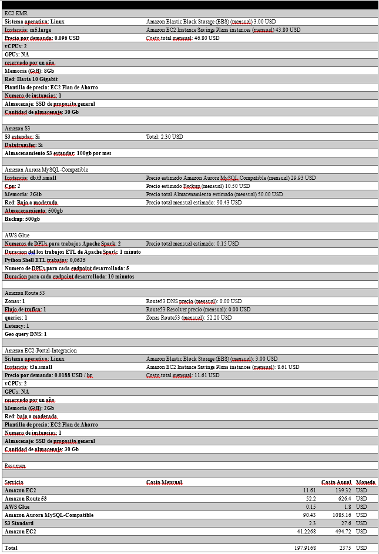

```{r setup, include=FALSE}
knitr::opts_chunk$set(echo = TRUE)
library(dplyr)
library(tidytext)
library(stringr)
library(jsonlite)
library(reshape2)
library(ggplot2)
library(corrplot)
library(factoextra)
library(caret)
```

## Introducción

Durante este análisis vamos a estudiar la existencia de algunas características que vuelvan propensos al desempleo a los egresados de la carrera de Ingeniería en Sistemas de la UNAH. La recolección de información se hizo mediante la aplicación de una encuesta a egresados de la carrera. Al ser parte de una generación pronta a egresar, conocemos la importancia de estudiar el panorama laboral y preocuparnos por lo que nos depara el mercado, por lo que estos resultados podrán tomarse en cuenta para mejorar nuestras costumbres y competencias, para volvernos más cercanos a lo que el mercado necesita.

```{r reading_dataset, echo=FALSE}
setwd("C:/Users/Luis/Desktop/Cap4/caracteristicas_empleo_IS/")
survey <- read.csv("Encuesta Seminario.csv",header = T, sep = ",", encoding = "UTF-8")
stop_words_spanish <- read.delim("stop_words_spanish.txt", header = TRUE, sep = "\n", encoding = "UTF-8")
str(survey)
```

Como resultado de la aplicación de la encuesta, se capturaron `r nrow(survey)` observaciones y `r length(names(survey))` columnas, organizandolas en las siguientes categorías:

    1. Información demográfica.
    2. Rendimiento universitario.
    3. Post-universidad.
    4. Hardskills.
    5. Softskills.

De manera recopilatoria, a continuación un resumen de la información recabada:

```{r}
summary(survey)
```

## Tratamiento de columnas

Eliminamos la columna portafolio debido a incongruencias y mala redacción, cosa que sería problemático e inútil para su análisis. De igual forma, se agregan los nombres de columnas.

```{r echo=FALSE}
names(survey)
my.names <- names(survey)


columnas_a_tratar <- my.names[!(names(survey) %in% c("portafolio"))]
df <- data.frame(columna.name = columnas_a_tratar)
df$columna.name


write.csv(df,"column_names.csv", row.names=FALSE)

column_names <- read.csv("column_names_clean.csv",header = T, sep = ",")

column_names$translation
names(survey)

names(survey) <- column_names$translation

names(survey)
survey$clases_por_periodo
```
### Pasando a factor:

#### edad
```{r echo=FALSE}
str(survey$edad)
survey$edad <- as.factor(survey$edad)
str(survey$edad)
```

#### promedio_graduacion
```{r echo=FALSE}
str(survey$promedio_graduacion)
survey$promedio_graduacion <- as.factor(survey$promedio_graduacion)
str(survey$promedio_graduacion)
```

### meses_desempleado

```{r echo=FALSE}
survey$meses_desempleado
survey$meses_desempleado <- as.factor(survey$meses_desempleado)
str(survey$meses_desempleado)
```

### Limpiando valores nulos
De manera tradicional, uno de los tratamientos más convencionales que se le realiza a la información para su análisis, es la detección de valores nulos.

```{r echo=FALSE}
summary(survey)
na.summay <- c()

for( myname in names(survey)){
  print(myname)
  
  s <- as.data.frame(prop.table(table(is.na(survey[,myname]))))
  operacion <- s %>% filter(Var1 == TRUE) %>% select(Freq)
  
  df_temp <- data.frame( 
    column.name=c(myname),  
    na.percentage = ifelse( length(operacion$Freq) == 0, 0, operacion$Freq[1] )
  )
  
  na.summay <- rbind(na.summay,df_temp)
}
```


## Análisis descriptivo

### Género
Nuestras respuestas vienen en su mayoría de un público masculino, sin dejar de tener la aparición de una considerable participación femenina.En este momento no es una sorpresa que existan más personas de género masculino dentro de nuestra carrera, eso se pudo inferir desde el análisis de la matrícula de los últimos años y de los egresados anuales, sin embargo, existe una tendencia a la diversificación en lo que a género se refiere.

```{r echo=FALSE}
library(RColorBrewer)

survey$genero <- as.factor(survey$genero)

ggplot(data=survey, aes(as.factor(genero) )) + geom_bar(color="blue", fill=rgb(0.1,0.4,0.5,0.7), aes(y=..prop.., group = 1)) + labs(x ="Genero", y= "Pocentaje") 
```

### Proactividad
Una persona proactiva sin dudas se destaca de las demás en el caso de la ingeniería en donde constantemente hay que proponer soluciones es una habilidad que se tiene que desarrollar.Se observan los niveles de proactividad presentados a los estudiantes recién graduados en donde 1 es el más bajo y 5 el más alto, no se observan coincidencias con el valor más bajo por lo que en valores de 3 hacia arriba son los números más relevantes por lo tanto se puede concluir que son habilidades que utilizan a diario en el ámbito que se desenvuelven.

```{r echo=FALSE}
survey$nivel_proactividad
data_proactividad <- prop.table(table(survey$nivel_proactividad))

data_proactividad <- data.frame(data_proactividad)


ggplot(data=data_proactividad, aes(x=Var1, y=Freq)) + geom_bar( stat="identity", color="black", fill=rgb(0.4,0.2,0.1,0.7), aes(fill=Var1)) +
 labs(x ="nivel proactividad", y= "Porcentaje") 
```

### Promedio de graduación
Se aprecia que un porcentaje considerablemente mayoritario de nuestros encuestados figuran bajo el preciado 80% que los categorizaría como estudiantes de excelencia académica, y este hecho podría afectar negativamente en un escenario de solicitud de empleo en el que exista una considerable cantidad de postulantes, en este caso, lo más probable es pensar que los que tengan mejor promedio tengan más posibilidades.

```{r echo=FALSE}
survey$promedio_graduacion[[21]] <- 78
survey$promedio_graduacion <- as.numeric(paste(survey$promedio_graduacion))

summary(survey$promedio_graduacion)

ggplot(survey, aes(y=promedio_graduacion)) + geom_boxplot(aes(x = factor(1)))
```

### Hardskills
El área común más débil es el nivel de inglés, seguidamente del nivel de redes y de administración curiosamente el nivel de programación no obtiene datos en el apartado de “poco”.

En el apartado de neutro se puede observar que en casi todas las áreas el nivel de neutro es bastante relevante lo que lleva pensar que se imparte lo necesario de conocimientos en las áreas mencionadas. El análisis del apartado de “muy bien” es el dato de menos relevancia o frecuente, en cambio en el apartado de “más que poco” lo lidera el nivel de redes seguido del nivel de diseño e inglés. En el apartado de “bien” se hace notar el área favorita de los egresados de la carrera de ingeniería en sistemas que es la programación seguida de cerca del nivel de diseño.

``` {r echo=FALSE}
survey$nivel_autodidacta

nombre_columnas <- c(rep("nivel_ingles" , 5),  rep("nivel_programacion" , 5)
                     ,rep("nivel_redes" , 5) ,rep("nivel_disenio" , 5),
                     rep("nivel_admin", 5))

condicion <- rep(c("poco","mas que poco","neutro","bien","muy bien"), 5)

valor_nivel_ingles <- prop.table(table(survey$nivel_ingles))
valor_nivel_programacion <- prop.table(table(survey$nivel_programacion))
valor_nivel_redes <- prop.table(table(survey$nivel_redes))
valor_nivel_disenio <- prop.table(table(survey$nivel_disenio))
valor_nivel_admin <- prop.table(table(survey$nivel_admin))

valor_nivel_ingles[[2]]

valor <- c(valor_nivel_ingles[[1]], valor_nivel_ingles[[2]],valor_nivel_ingles[[3]],valor_nivel_ingles[[4]],valor_nivel_ingles[[5]],
           0.0,valor_nivel_programacion[[1]],valor_nivel_programacion[[2]],valor_nivel_programacion[[3]],valor_nivel_programacion[[4]],
           valor_nivel_redes[[1]],valor_nivel_redes[[2]],valor_nivel_redes[[3]],valor_nivel_redes[[4]],0.0,
           valor_nivel_disenio[[1]],valor_nivel_disenio[[2]],valor_nivel_disenio[[3]],valor_nivel_disenio[[4]],valor_nivel_disenio[[5]],
           valor_nivel_admin[[1]],valor_nivel_admin[[2]],valor_nivel_admin[[3]],valor_nivel_admin[[4]],valor_nivel_admin[[5]]) 

df_plot_hs <- data.frame(nombre_columnas, condicion, valor)

ggplot(df_plot_hs, aes(fill=condicion, y=valor, x=nombre_columnas)) + 
    geom_bar(position="dodge", stat="identity") + 
    coord_flip()
```

## Correlaciones
Un estudio correlacional determina si dos variables están correlacionadas o no. Esto significa analizar si un aumento o disminución en una variable coincide con un aumento o disminución en la otra variable. A continuación, relacionaremos las variables descritas anteriormente y buscaremos alguna correspondencia entre ellas.

### Género - Proactividad
El motivo de esta correlación, es tratar de inferir si existe una correspondencia entre la percepción personal del nivel de proactividad de una persona egresada de la carrera de ingeniería en sistemas de la UNAH, en función de su género.

#### Hipótesis
    H_0: El nivel de proactividad y el género son independientes.
    H_A: El nivel de proactividad y el género son dependientes.
    
```{r echo=FALSE}
prop.table(table(survey$nivel_proactividad,survey$genero),1)

ggplot(survey) +
  aes(x = nivel_proactividad, fill = factor(genero)) +
  geom_bar(position="stack")

#H_0: Las categorías de nivel de proactividad y género, son independientes.
#H_A: Las categorías son dependientes.

chisq.test(table(survey$nivel_proactividad,survey$genero))
```

Nuestro p-value basado en la información recabada en la encuesta, corresponde a un valor superior a 0.05, por lo que teóricamente se rechaza la hipótesis nula (H_0).

### Promedio - Proactividad
Este análisis se lleva a cabo con la finalidad de verificar si existe una relación entre la proactividad de un estudiante y su índice académico, pues mucho se dice que quienes más ponen de sí mismos, mejores calificaciones podrían tener.

#### Normalidad de la distribución de promedio de graduación
    H_0: Nuestra distribución es normal.
    H_A: Nuestra distribución no es normal.

Al iniciar el análisis, nos encontramos con un par de valores atípicos que aumentan el error demasiado. Arrojándonos un p-value demasiado bajo.

```{r echo=FALSE}
boxplot(survey$promedio_graduacion)
qqnorm(survey$promedio_graduacion)
qqline(survey$promedio_graduacion)
shapiro.test(survey$promedio_graduacion)
```

Considerando esta incidencia, nos dispondremos a cambiar esos pocos valores atípicos que nos llenan el análisis de error. De esta forma, obtenemos un p-value que nos permite no rechazar nuestra hipótesis nula (H_O).
```{r echo=FALSE}
var_aux <- median(survey$promedio_graduacion)
survey[survey$promedio_graduacion > 85 , "promedio_graduacion"] <- var_aux
survey[survey$promedio_graduacion < 70 , "promedio_graduacion"] <- var_aux
boxplot(survey$promedio_graduacion)
qqnorm(survey$promedio_graduacion)
qqline(survey$promedio_graduacion)
shapiro.test(survey$promedio_graduacion)
```

#### Normalidad de las agrupaciones
A continuación dividiremos nuestra distribución por su promedio en función de nuestra variable categórica (Nivel de proactividad). De la misma manera analizaremos su normalidad bajo la misma hipótesis nula (H_0).

##### Agrupación de nivel de proactividad 2-4 (Baja) 
Con un p-value superior a 0.05 no podemos rechazar la hipótesis nula (H_0).
```{r echo=FALSE}
gp_bajo <- survey %>% filter(nivel_proactividad %in% c("2","3","4")) %>% select(promedio_graduacion)
qqnorm(gp_bajo$promedio_graduacion)
qqline(gp_bajo$promedio_graduacion)
shapiro.test(gp_bajo$promedio_graduacion)
```

##### Agrupación de nivel de proactividad 5 (Alto)
De la misma manera que en el caso anterior, el p-value es mayor a 0.05, por lo que no rechazamos la hipótesis nula (H_0).
```{r echo=FALSE}
gp_alto <- survey %>% filter(nivel_proactividad =="5") %>% select(promedio_graduacion)
qqnorm(gp_alto$promedio_graduacion)
qqline(gp_alto$promedio_graduacion)
shapiro.test(gp_alto$promedio_graduacion)
```


#### Homocedasticidad de las agrupaciones
Con un p-value mayor a 0.05 no rechazamos la hipótesis nula y suponemos homogeneidad de las varianzas de ambos grupos.
```{r echo=FALSE}
var.test(gp_bajo$promedio_graduacion,gp_alto$promedio_graduacion)
```

#### Análisis de medias de las agrupaciones
Con un p-vaue superior a 0.05, no podemos rechazar nuestra hipótesis nula. Por lo tanto suponemos que las medias son iguales, y en función de ello, no podemos concluir, ya que ambos grupos tienen un comportamiento similar.
```{r echo=FALSE}
t.test(
  gp_bajo$promedio_graduacion,gp_alto$promedio_graduacion,
  alternative = "two.sided",
  paired = FALSE,
  var.equal = TRUE
  )
```

### Hardskills
Este análisis se realiza para intentar encontrar una relación entre las habilidades técnicas de los egresados, es decir, para saber si existe una tendencia que indique si algunas habilidades técnicas se ligan a unas y repelen a otras.

#### Nivel de redes
```{r echo=FALSE}

numeric_corr <- survey %>% select(nivel_redes, nivel_programacion, nivel_ingles, nivel_admin, nivel_disenio)

boxplot(numeric_corr$nivel_redes)
```

#### Nivel de programacion
```{r echo=FALSE}
boxplot(numeric_corr$nivel_programacion)
```

#### Nivel de inglés
```{r echo=FALSE}
boxplot(numeric_corr$nivel_ingles)
```

#### Nivel de administración
```{r echo=FALSE}
boxplot(numeric_corr$nivel_admin)
```

#### Nivel de diseño
```{r echo=FALSE}
boxplot(numeric_corr$nivel_disenio)
```

#### Correlación entre habilidades
En los gráficos siguientes se representarán los resultados del análisis correlacional entre cada una de las áreas, destacando particularmente el alejamiento encontrado entre el inglés y las demás habilidades.
```{r echo=FALSE}
x <- cor(numeric_corr, method = c("pearson", "kendall", "spearman"))
corrplot(x, type = "upper", order = "hclust", tl.col = "black", tl.srt = 45)
```

Es en esta sección donde es más visible la imposibilidad de conclusión con respecto al inglés y las demás habilidades, pues el ángulo obtenido y su respectivo coseno nos arrojarán un valor cercano a cero. Sin embargo, si podemos ver una cercanía entre las áreas de redes y programación, así como de administración y diseño. 
```{r echo=FALSE}
res <- prcomp(numeric_corr, scale = F)
#fviz_eig(res)
#fviz_pca_ind(res, col.ind = "cos2", gradient.cols = c("#00AFBB","#E7B800","#FC4E07"), repel = TRUE)
fviz_pca_var(res, col.var = "contrib", repel = TRUE)
fviz_pca_biplot(res, repel = TRUE, col.var = "#2E9FDF", col.ind = "#696969")

k2 <- kmeans(res$x[,1:2], centers = 2, nstart = 25)
fviz_cluster(k2, data = res$x[,1:2])
k2$cluster
#cbind(survey,k2$cluster)
```

### Análisis explicativo

#### Definición de la variable de respuesta
En nuestro caso de estudio la variable de respuesta y variable dependiente será la empleabilidad de los graduados de ingeniería en sistemas, dicha variable está definida en nuestra encuesta por la siguiente pregunta:

    ¿Actualmente tienes trabajo?
    
#### Aplicación de regresión logística para los factores más importantes
##### Encontrar coeficientes para predicción
Estos servirán al momento de tener un nuevo registro (encuesta) se podrían analizar al multiplicar los datos por los coeficientes y al sumarlos podríamos analizar la empleabilidad del encuestado.

Nota: la variable encuesta es el dataframe que almacena los resultados de nuestra encuesta.

##### Cálculo de overall
Encuentra el nivel de importancia de las variables al momento del calcular un valor predictivo de nuevos registros.
```{r echo=FALSE}
survey$tiene.empleo <- "0"
survey[survey$trabajo_actual == "No", "tiene.empleo"] <- "1"
 
 
prop.table(table(survey$tiene.empleo))
 
vindependientes <- c(
    "genero",
    "edad",
    "nivel_ingles",
    "nivel_servidores",
    "nivel_programacion",
    "actividades_extracurriculares",
    "tiene.empleo"
)

datos_new <- survey[,names(survey) %in% vindependientes] 

datos_new$tiene.empleo <- as.factor(datos_new$tiene.empleo)

modelo <- glm(tiene.empleo ~ .,  data= datos_new, family="binomial")

centinela <- varImp(modelo)
centinela$col <- row.names(centinela)
centinela <- centinela %>% arrange(-Overall)
centinela
```

##### Gráficos
A continuación, se tratará de contestar la siguiente pregunta de investigación 
¿Qué características poseen los graduados de ingeniería en sistemas que están actualmente contratados?
Según el análisis de los factores y gráficos la mayoría de empleados tienen las siguientes características: un nivel de inglés razonable, una edad menor a 30 años, un nivel aceptable de administración de servidores, entre otros.

    Notas para la lectura de gráficos: El 1 significa que no posee empleo y el cero significa que si lo tiene.  

###### La mayoría de los egresados con empleo tienen una edad menor a 30 años
```{r echo=FALSE}
ggplot(datos_new) +
    aes(x=edad, fill=factor(tiene.empleo))+
    geom_bar(position = "fill")+
    theme(axis.title.x = element_text(angle = 45))+
    scale_fill_manual(values = c("#8bb83a","#800000"))
```

###### La empleabilidad es del 100% si posee un nivel de ingles alto
```{r echo=FALSE}
ggplot(datos_new) +
    aes(x=nivel_ingles, fill=factor(tiene.empleo))+
    geom_bar(position = "fill")+
    theme(axis.title.x = element_text(angle = 45))+
    scale_fill_manual(values = c("#8bb83a","#800000"))
```

###### La empleabilidad de los graduados te tienen conocimientos de administración de servidores es mayor a los que no tienen dicho conocimiento
```{r echo=FALSE}
ggplot(datos_new) +
    aes(x=nivel_servidores, fill=factor(tiene.empleo))+
    geom_bar(position = "fill")+
    theme(axis.title.x = element_text(angle = 45))+
    scale_fill_manual(values = c("#8bb83a","#800000"))
```

### Solución tecnológica

#### Comunicación
Nuestra solución tecnológica  hace uso de la plataforma de AWS. Consiste en 3 partes de comunicación esencial para su efectiva funcionalidad. Primero tenemos la conexión Seguro social y UNAH que es donde vamos a compilar información importante del estudiante, seguido de Hadoop donde toda la información que obtengamos del seguro social y de la unah será manipulada en esta parte de la solución tecnológica. 

Y tenemos el portal del estudiante  donde este estará almacenado en un EC2 en aws y se usará elastic beanstalk para desarrollar esta parte de la infraestructura. En el portal es donde el estudiante estará proporcionando su CV para poder ser analizado en hadoop con la información de la UNAH y del seguro social. Una vez analizada la información todo será regresado al portal del estudiante en el cual estará el estado de empleabilidad para que el lo vea o si se decide sera solo de acceso administrativo.

##### Seguro social - UNAH
Una vez que el estudiante esté listo para su práctica profesional y  abra expediente en las oficinas de ingeniería en sistemas, el tendrá que enviar su CV a nuestra plataforma. Una vez tenido el CV inicia el proceso de recopilación de información. La información del CV será manipulada en Hadoop Mahout.


Una vez que el estudiante esté listo para su práctica profesional y  abra expediente en las oficinas de ingeniería en sistemas, el tendrá que enviar su CV a nuestra plataforma. Una vez tenido el CV inicia el proceso de recopilación de información. La información del CV será manipulada en Hadoop Mahout. 

Como habíamos dicho anteriormente en el Capítulo II, primero se ocupará hacer unas pruebas de entrenamiento para el algoritmo de aprendizaje automático. Así mismo, este algoritmo se estará re-aprendiendo cada dos años debido a que las tecnológicas son cambiantes. En este caso es donde entra la conexión Seguro Social - UNAH. Nosotros necesitamos saber cómo luce un CV apto para la empleabilidad o uno no apto para la empleabilidad. Esto lo podemos resolver sabiendo si el estudiante labora después de su graduación. Primero traemos los datos de la UNAH para saber los datos de identificación personal del estudiante y compararlos con los del seguro social. Si se registran reducciones recientes  en las cuentas de dichos estudiante quiere decir que están actualmente laborando. 


##### Portal web - AWS Elastic beanstalk


El portal web estará montando en los servidores de AWS y estaremos usando Elastic Beanstalk por razones de organización. Elastic Beanstalk es solo una integración con muchas otras tecnologías dentro de los servicios que ofrece AWS que en nuestro caso nos ayudará a mantener organizado nuestro trabajo y nos ahorra tiempo de configuración.

Si bien es cierto, el portal sólo lo estarán viendo los estudiantes o los administradores de la carrera de ingeniería en sistemas, a nosotros los desarrolladores nos servirá para integrar toda la información que viene de hadoop y que va para hadoop. 

##### Hadoop - AWS Glue


Una vez consumidas las APIs del Seguro Social y de la UNAH esta información se estar guardando en una base de datos relacional. Donde se estará utilizando AWS Glue como herramienta de Extracción, carga y transformación. Antes de enviar la información a Hadoop  primero preparamos los datos y despues enviemos a Hadoop. 

Hadoop es un set de tecnologías para aplicaciones en forma de cluster que mayormente se utilizan para el trabajo de datos masivos. En nuestro caso estamos interesado en la interacción que tiene con computación distribuida y las capabilidades de la herramienta madura como Mahout para el desarrollo de algoritmos de aprendizaje automático. 

Una vez nuestra información se encuentre de forma ordenada en AWS glue, está pasara a Hadoop donde sera utlizara para entrenar y posteriormente se utilizará para decidir el nivel de empleabilidad de los CVs de diferentes alumnos de la carrera de ingeniería en sistema de la UNAH.


#### Presupuesto


